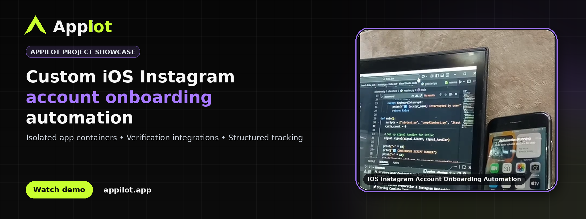
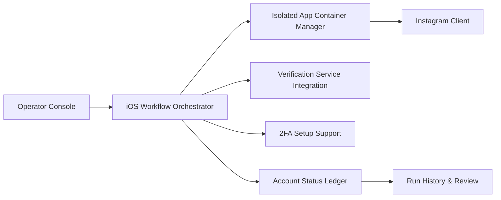
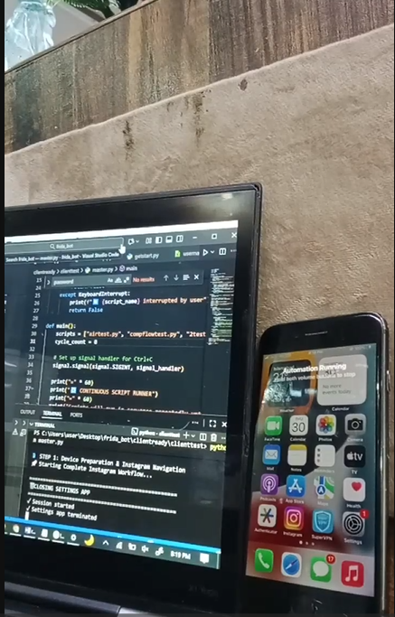
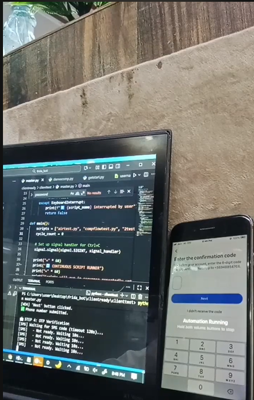
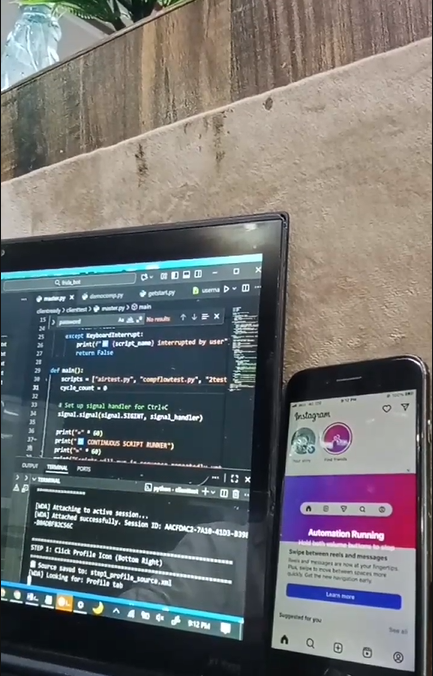

# Instagram Account Creation Automation  

** A custom iOS Instagram account onboarding workflow using isolated app containers, verification integrations, and structured account tracking.**

[](https://www.appilot.app/) [](https://youtu.be/nT_ls9OwprE)

## Demo Video

[](https://youtu.be/nT_ls9OwprE)

**Watch on YouTube:** https://youtu.be/nT_ls9OwprE

## Overview

Appilot showcase for a custom iOS Instagram account onboarding workflow using isolated app containers, verification integrations, and structured account tracking. The project was built as a custom Appilot engagement to coordinate mobile workflows from a central operations layer while keeping device state, scheduling and run visibility easy for an operator to review.


## Core Capabilities

| Capability | What it provides |
|---|---|
| **Isolated iOS app environments** | Coordinate separate app containers for authorized account-onboarding workflows. |
| **Guided onboarding orchestration** | Move each approved onboarding session through a consistent sequence and capture its state. |
| **Verification integrations** | Connect external verification services through configurable API integrations. |
| **2FA support** | Include two-factor authentication setup as part of the managed onboarding checklist. |
| **Structured account tracking** | Record account identifiers, creation timestamps and operational status in a central ledger. |
| **Repeatable cleanup** | Reset the isolated application environment between approved sessions to keep test and operations data separated. |

## Architecture



For a component-by-component explanation, see [ARCHITECTURE.md](ARCHITECTURE.md).

## Workflow

1. Start an authorized onboarding session from the operator console.
2. Prepare an isolated application container on the managed iPhone.
3. Run the guided Instagram onboarding flow and connect configured verification services.
4. Capture the account status and required operational metadata.
5. Close the session, clean the isolated environment and retain the audit record.

## Screenshots

### 1. Laptop and iPhone running a custom iOS Instagram automation session



### 2. iPhone verification screen connected to the automation workflow



### 3. Instagram app running on an iPhone beside the automation console




## Repository Contents

```text
appilot-instagram-account-creation-ios-automation/
├── README.md
├── ARCHITECTURE.md
├── DEMO.md
├── REPOSITORY-SETUP.md
├── RESPONSIBLE-USE.md
├── LICENSE.md
├── repo-metadata.json
├── .gitignore
├── .github/
│   └── ISSUE_TEMPLATE/
│       └── config.yml
└── assets/
    ├── banner.png
    └── screenshots/
        ├── 01-ios-automation-session.png
        ├── 02-instagram-verification-workflow.png
        └── 03-instagram-ios-automation-running.png
```

## Want a Custom Version?

Appilot builds custom mobile automation systems around real-device fleets, operational dashboards and business-specific workflows. If your process requires a tailored device setup, scheduling layer, integrations or reporting, discuss the scope with the Appilot team.

**Website:** https://www.appilot.app/


